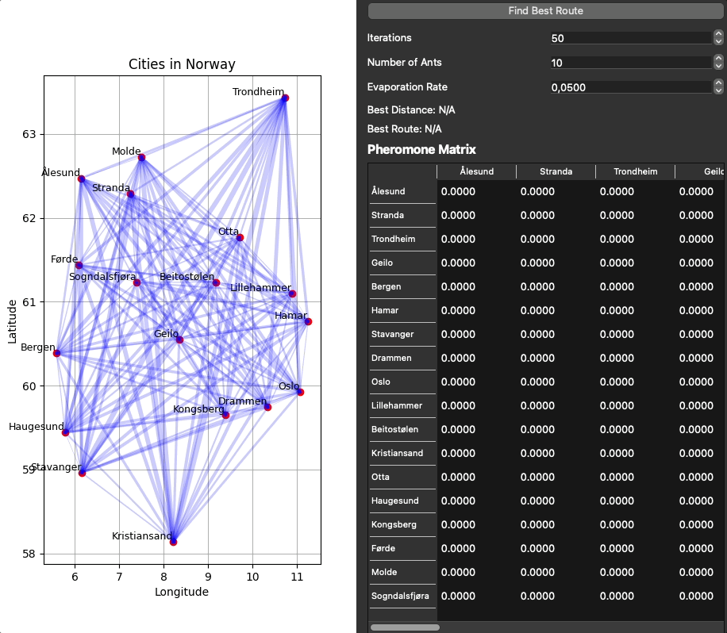

# Assignment Part C
This is part of my delivery for AIS2101 - Assignment Part C

# Table of Contents
- [Overview](#overview)
- [Installation and Setup](#installation-and-setup)
  - [Clone the Repository](#clone-the-repository)
  - [Setup](#setup)
- [Usage](#usage)

# Overview
This is my delivery for assignment part c in the class AIS2101. 
This includes the implementation and construction of an ACO (Ant Colony Optimization) algorithm solving
the travelling salesman problem for cities in Norway

# Installation and Setup
This section describes how to install and use the algorithm
## Clone the Repository
````
git clone https://github.com/HermanGran/Assignment-Part-C.git
````

## Setup
Install the libraries used in the terminal
````shell
pip install -r requirements.txt
````

# Usage
After you have cloned and installed the required dependencies, you can run ```main```. 
This will show the Gui, where you can change the different key values to test the best configuration of the ACO.
Below is a demonstration of the GUI

In main you can also change the file from cities.csv to cities_small.csv to test the algorithm on fewer cities.

<p align="center">
  
</p>