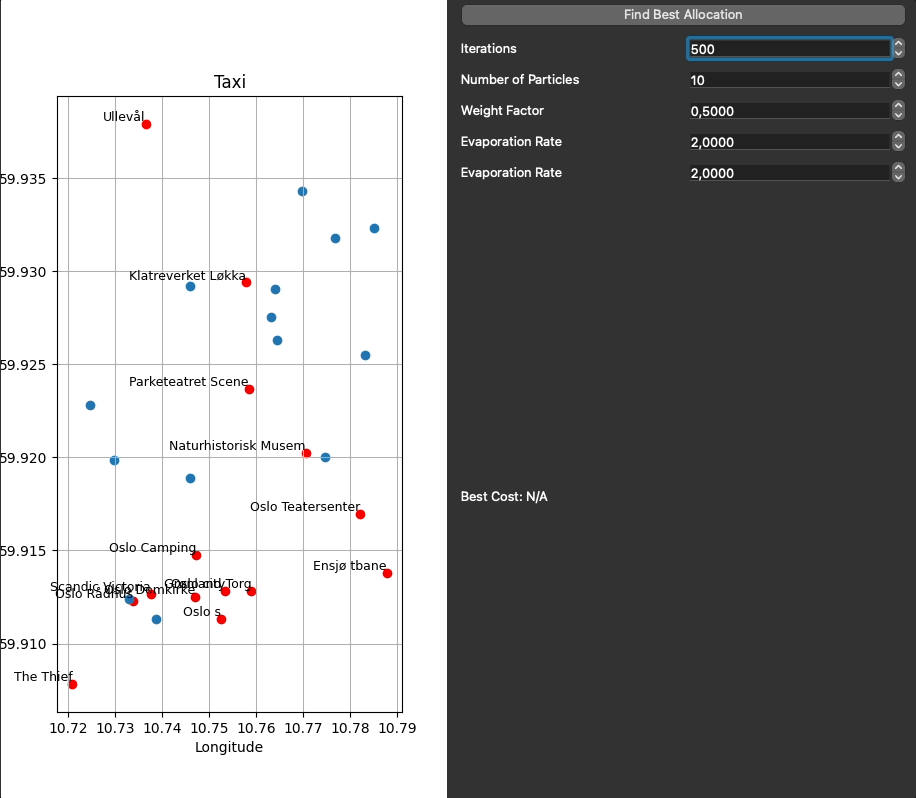

# Assignment Part C

This repository contains my submission for AIS2101 Assignment Part C. It features implementations of two optimization algorithms:
- **Ant Colony Optimization (ACO):** Solves the Traveling Salesman Problem (TSP) using cities in Norway.
- **Binary Particle Swarm Optimization (BPSO):** Addresses a taxi allocation problem.

## Table of Contents
- [Overview](#overview)
- [Installation and Setup](#installation-and-setup)
  - [Clone the Repository](#clone-the-repository)
  - [Setup](#setup)
- [Usage](#usage)
  - [Ant Colony Optimization (ACO)](#ant-colony-optimization-aco)
  - [Binary Particle Swarm Optimization (BPSO)](#binary-particle-swarm-optimization-bpso)

## Overview

This project is part of my delivery for AIS2101 Assignment Part C. It includes:

- **Ant Colony Optimization (ACO):**  
  Implements ACO to solve the TSP for cities in Norway by finding an optimal route that minimizes travel distance.

- **Binary Particle Swarm Optimization (BPSO):**  
  Uses BPSO to solve a taxi allocation problem by optimally assigning taxis to customers.

## Installation and Setup

### Clone the Repository

Clone the repository using:

```bash
git clone https://github.com/HermanGran/Assignment-Part-C.git
```

### Setup

Navigate to the repository directory and install the required libraries with:

```bash
pip install -r requirements.txt
```

## Usage

After installation, you can run the algorithms by launching the ```main.py``` file. Choose the problem type and corresponding algorithm by setting the mode to either "ACO" or "BPSO", and selecting the appropriate CSV file:

- Use ```cities.csv``` for the ACO algorithm
- Use ```taxi.csv``` for the BPSO algorithm

### Ant Colony Optimization (ACO)

When "ACO" is selected with the cities.csv file, the program launches a GUI that lets you adjust key parameters (iterations, number of ants, evaporation rate, etc.) to find the best configuration for the ACO algorithm. You can also test the algorithm on a smaller dataset by switching to cities_small.csv.

Below is a demonstration of the ACO GUI:

<p align="center">  </p>

### Binary Particle Swarm Optimization (BPSO)

When "BPSO" is selected with the taxi.csv file, the program launches a GUI that allows you to configure various parameters for the BPSO algorithm. This interface lets you explore different settings to optimize the taxi assignment process.

Below is a demonstration of the BPSO GUI:

<p align="center">  </p> 